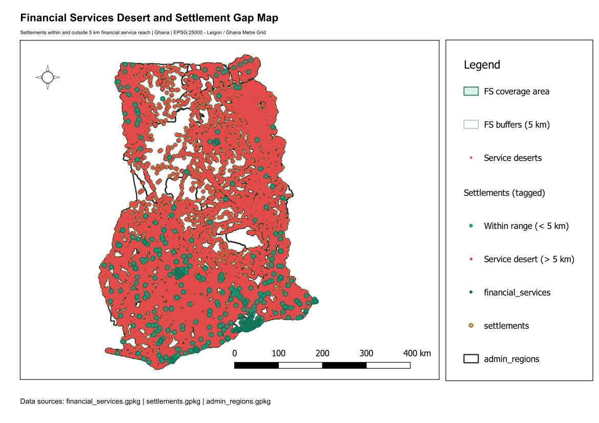

# Financial Services Desert and Settlement Gap Map

**Country:** Ghana
**CRS:** EPSG:25000 - Leigon / Ghana Metre Grid
**Project file:** `Financial_Services_Desert_Gap_Map.qgz`

---

## Overview

This project maps financial service deserts across Ghana by identifying populated settlements that fall outside any financial service coverage zone. Buffer polygons around existing financial outlets define served areas, and settlements outside these buffers are classified as underserved. The result is a gap map that spatially locates communities with no accessible financial services.

## Reference Layout

---

## Objectives

- Generate coverage zones around all known financial service locations.
- Identify settlements that fall entirely outside any coverage zone (financial service deserts).
- Tag all settlements with their service coverage status and region.

## Methodology

1. Financial services reprojected to EPSG:25000; buffer polygons generated to approximate service catchment areas, output as `financial_services_buffers.gpkg`.
2. Buffer polygons dissolved into a single coverage layer: `financial_services_coverage.gpkg`.
3. Settlements reprojected and tagged with region attribute: `settlements_tagged_with_region.gpkg`.
4. Settlements outside all coverage buffers identified and extracted: `settlements_service_desert.gpkg`.
5. All settlements tagged with a coverage indicator stored in `settlements_tagged.gpkg`.

## Output Layers

| File | Description |
|------|-------------|
| `financial_services_buffers.gpkg` | Individual buffer zones around each financial service outlet |
| `financial_services_coverage.gpkg` | Dissolved coverage polygon representing served area |
| `settlements_tagged.gpkg` | All settlements with financial service coverage flag |
| `settlements_tagged_with_region.gpkg` | Settlements tagged with region and coverage attributes |
| `settlements_service_desert.gpkg` | Settlements falling outside all financial service coverage zones |

## Key Findings

- A significant share of Ghana's settlements, particularly in the Savannah, Bono East, and Northern East regions, are beyond any financial service coverage zone.
- The gap is most pronounced in low-road-density areas where physical access to towns with banking infrastructure is limited.
- The desert layer serves as a direct input for financial inclusion targeting by DFIs and mobile money expansion strategies.

## Deliverables

| File | Type |
|------|------|
| `Financial_Services_Desert_Gap_Map.qgz` | QGIS project |
| `Financial_Services_Desert_Gap_Map.pdf` | Exported map layout |
| `reference_layout.png` | Print layout reference image |

## Notes

- All layers use EPSG:25000 (Leigon / Ghana Metre Grid).
- The buffer distance applied to financial services should be reviewed against local mobility assumptions when interpreting desert boundaries.

---

## Map Preview

